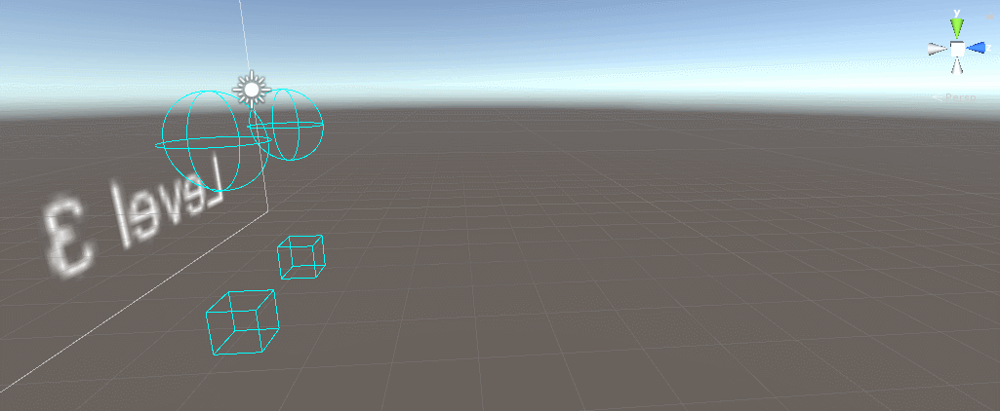
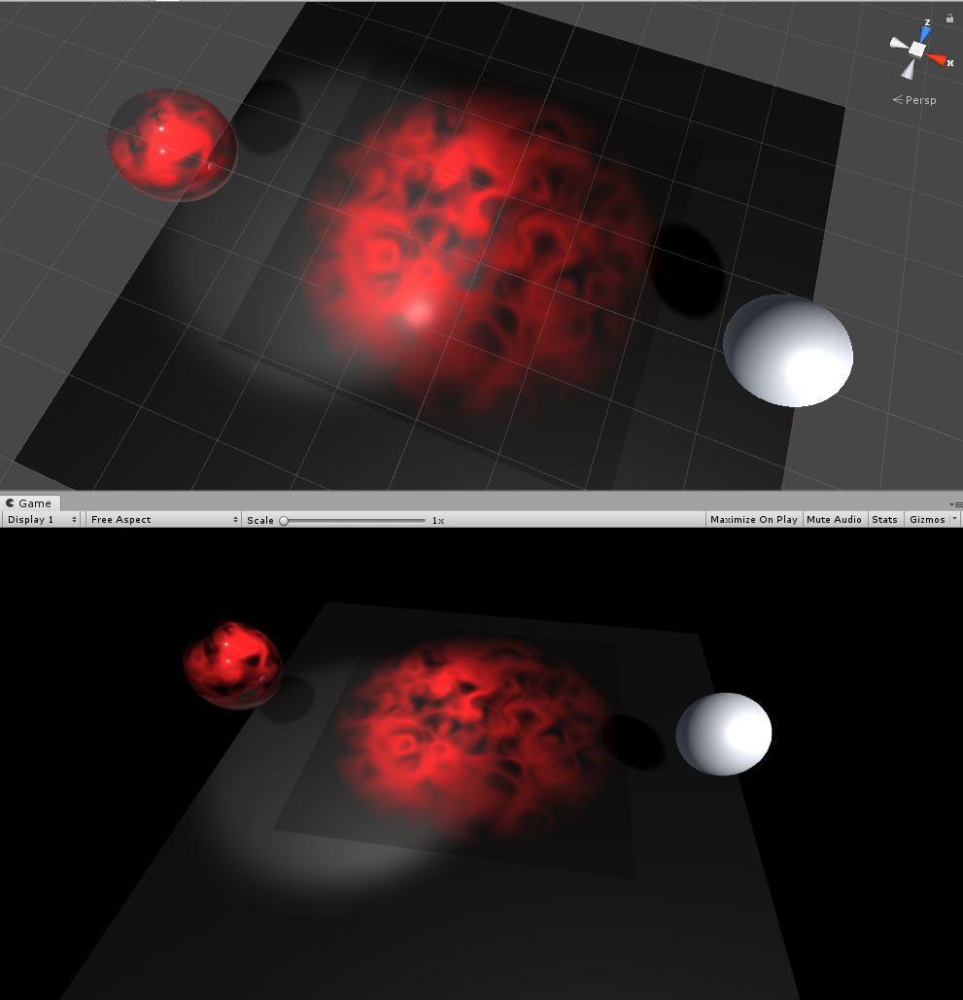

# testUnity
a test library for Unity  

(1) Unity2AndroidStudio  
A demo project for Unity character import to Android Studio  
  

    
     

  
(2) Mesh Deformation   
Script generated mesh support touch deforamtion  
  

    
     

  
(3) Object Management Series of Catlike Tutorial   
C# Tutorial and design patterns  
  

    
     

  
  
(4) Render Series of Catlike Tutorial   
Self-implemented render series  
  

    
     

  
    
(5) Basic Control and Management   
An ARPG Demo with basic control and object lifetime and behavior management
  

    
     

  

[more game clips](https://github.com/scheninsp/testUnity/tree/master/TestProjects/UI_LandScape_LWRP/UI_Landscape_LW_cap1.PNG)  
  
  