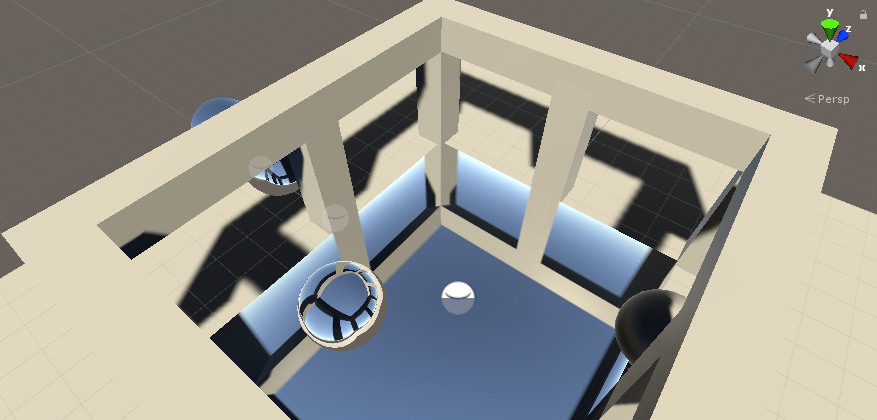
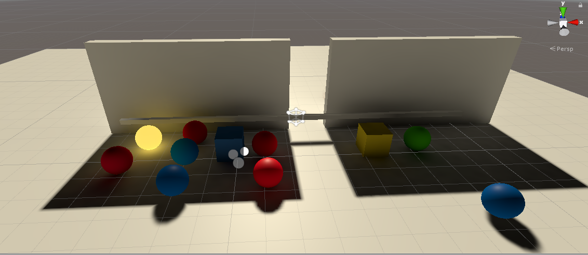

# testUnity
a test library for Unity  

(1) Unity2AndroidStudio  
A demo project for Unity character import to Android Studio  
  

    
     

  
(2) Mesh Deformation   
Script generated mesh support touch deforamtion  
  

    
     

  
(3) Object Management Series of Catlike Tutorial   
C# Tutorial and design patterns  
  

    
     

  
  
(4) Render Series of Catlike Tutorial (CG)  
Self-implemented render series  

    
     

  

(5) Srciptable Render Pipeline of Catlike Tutorial (HLSL)  
Self-implemented SRP  
[source code](https://github.com/scheninsp/testUnity/tree/master/ScriptableRenderPipeline)
  

    
     
	
	 

  
    
	
(6) Basic Control and Management   
An ARPG Demo with basic control and object lifetime and behavior management  
[more game clips](https://github.com/scheninsp/testUnity/tree/master/TestProjects/UI_LandScape_LWRP/)
  

    
     

  
  
  